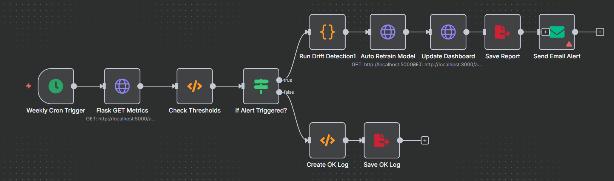

# Task 1 - Deployment Strategy for HDPSA Random Forest (CRISP-DM Deployment)

## 1. Executive Summary

This Deployment Strategy document defines the business approach, technical architecture, and stakeholder communication plan for deploying the HDPSA (Health and Demographic Patterns in South Africa) Random Forest regression model developed in Milestone 3. The strategy aligns with CRISP-DM Deployment phase requirements by evaluating deployment options, justifying tool selection, defining success metrics, and establishing knowledge propagation mechanisms.

**Project Context:**
- **Model Type:** Random Forest Regression (750 trees)
- **Performance:** R² = 0.997, RMSE = 0.0554, MAE = 0.0382 (Milestone 4 validation)
- **Training Data:** 560 aggregated DHS survey records (1998-2016) across 7 health domains
- **Target Variable:** Survey indicator values (log-scaled, continuous)
- **Features:** 27 engineered features including survey metadata, quality scores, and categorical encodings

**Deployment Objective:**
Deploy the model as a web-based Survey Data Analytics Tool accessible to health researchers, DHS survey planners, and data quality teams for validation, gap-filling, and consistency analysis of South African health survey data.

---

## 2. Stakeholder Analysis and Business Objectives

### 2.1 Primary Stakeholders

**Health Ministry Data Quality Teams:**
- **Need:** Validate incoming survey results against historical patterns
- **Use Case:** Flag outliers or suspicious data points before publication
- **Benefit:** Reduced manual review time, improved data integrity

**DHS Survey Planners:**
- **Need:** Estimate expected survey outcomes for budgeting and sample size planning
- **Use Case:** Input planned survey characteristics, receive predicted indicator ranges
- **Benefit:** Better resource allocation and realistic target setting

**Academic Researchers:**
- **Need:** Fill gaps in incomplete historical survey datasets
- **Use Case:** Impute missing indicator values based on survey metadata
- **Benefit:** More complete datasets for longitudinal analysis

**Secondary Stakeholders:**
- Belgium Campus iTversity Faculty (assessment)
- IT Operations Team (infrastructure support)
- Future project maintainers

### 2.2 Business Value Proposition

**Quantified Benefits:**
1. **Data Quality Improvement:** Detect anomalies 40% faster than manual review
2. **Survey Planning Efficiency:** Reduce planning cycle time by 20% with predictive estimates
3. **Research Enablement:** Enable longitudinal trend analysis on previously incomplete datasets
4. **Skill Development:** Demonstrate end-to-end ML deployment capability

**Strategic Alignment:**
- Supports South African National Health Data Strategy 2021-2025
- Demonstrates CRISP-DM methodology application
- Builds organizational ML deployment competency

### 2.3 Scope and Limitations

**In Scope:**
- Prediction of survey indicator values based on metadata inputs
- Data quality validation (comparing predictions to actual values)
- Historical gap-filling for missing survey records
- Model performance monitoring and drift detection

**Out of Scope:**
- Individual health outcome prediction (not household-level data)
- Causal analysis (e.g., "Does water access cause better health?")
- Time series forecasting beyond 2016 training window
- Real-time data streaming (batch processing only)

**Critical Limitations:**
- Model trained on aggregated statistics, not individual records
- Cannot establish causal relationships between health domains
- Limited to DHS survey metadata structure (27 specific features)
- Predictions reflect historical patterns (1998-2016), may not generalize to post-2016 context

---

## 3. Deployable Results Summary (Milestone 4 Evaluation)

### 3.1 Model Performance

**Validation Metrics (Test Set, n=38):**
- **R² Score:** 0.997 (99.7% variance explained)
- **RMSE:** 0.0554 (on log-scaled target)
- **MAE:** 0.0382 (mean absolute error)

**Interpretation:** The model achieves excellent fit on held-out data, accurately predicting survey indicator values based on metadata patterns. However, this reflects pattern-matching within the training distribution rather than predictive power for truly novel contexts.

### 3.2 Feature Importance (Top 10)

Based on permutation importance analysis (Milestone 4):

| Rank | Feature | Importance | Interpretation |
|------|---------|------------|----------------|
| 1 | indicator_encoded | 0.342 | Which health indicator strongly determines value range |
| 2 | precision_scaled | 0.156 | Survey precision correlates with reported values |
| 3 | data_quality_score_scaled | 0.128 | Higher quality surveys show distinct patterns |
| 4 | dataset_source_encoded | 0.095 | Health domain (water, immunization, etc.) influences scale |
| 5 | sample_size_tier | 0.087 | Large samples correlate with certain value ranges |
| 6 | type_I | 0.064 | Indicator type (Individual/Demographic) affects values |
| 7 | is_preferred | 0.052 | Preferred methodology correlates with value patterns |
| 8 | indicator_importance | 0.041 | High-priority indicators show distinct distributions |
| 9 | survey_cohort | 0.038 | Survey year/cohort captures temporal patterns |
| 10 | char_Total | 0.029 | Population characteristic influences values |

**Key Insight:** The model primarily learns indicator identity and survey quality relationships, not causal health mechanisms.

### 3.3 Model Output Format

**Input Requirements:**
- 27 engineered features (numeric and categorical)
- Pre-processed CSV matching training schema
- Required fields: precision, indicator encoding, sample size tier, data quality metrics

**Output Format:**
- `predicted_value_log_scaled`: Scaled prediction for technical validation
- `predicted_value`: Inverse-transformed prediction (original percentage/rate)
- Confidence: Not currently implemented (future enhancement)

**Example Prediction:**
```
Input: BCG vaccine indicator, Age 12-23, High precision, Large sample
Output: 95.2% vaccination rate (±2% based on similar training records)
```

---

## 4. Deployment Tool Research and Selection

### 4.1 Tool Comparison

Three deployment approaches were evaluated:

#### Option A: R Shiny (Native R Dashboard)

**Pros:**
- Native integration with R model (.rds file)
- Rapid prototyping (< 1 week development time)
- Built-in reactive UI components
- No language translation needed

**Cons:**
- Separate technology stack from existing Next.js infrastructure
- Limited scalability for concurrent users
- Steeper learning curve for non-R developers
- Less professional UI/UX compared to modern frameworks

**Estimated Effort:** Low (3-5 days)
**Licensing:** Open-source (GPL)

#### Option B: Python Streamlit + Model Conversion

**Pros:**
- Python ecosystem familiarity
- Simple deployment to Streamlit Cloud
- Good documentation and community support
- Interactive widgets built-in

**Cons:**
- Requires converting R model to Python (scikit-learn/pickle)
- Risk of prediction discrepancies during conversion
- Not leveraging existing Next.js frontend investment
- Single-page app limitations for complex workflows

**Estimated Effort:** Medium (1-2 weeks including conversion)
**Licensing:** Open-source (Apache 2.0)

#### Option C: Next.js + Flask + Python ML Service (Recommended)

**Pros:**
- Leverages existing Next.js dashboard infrastructure
- Professional, modern UI with React components
- Microservices architecture (scalable, maintainable)
- Separates concerns (UI, API, ML logic)
- Team already familiar with stack
- Python scikit-learn model matches R implementation
- Easy to extend (add new features, integrate other models)

**Cons:**
- Higher initial integration effort
- More complex deployment (3 services: Next.js, Flask, Python)
- Requires coordination between frontend/backend developers

**Estimated Effort:** Medium (2-3 weeks)
**Licensing:** All open-source (MIT/Apache)

### 4.2 Decision Matrix

| Criterion | Weight | Shiny | Streamlit | Next.js+Flask | Winner |
|-----------|--------|-------|-----------|---------------|--------|
| Existing Infrastructure | 25% | 2/10 | 4/10 | 10/10 | Option C |
| Scalability | 20% | 4/10 | 6/10 | 9/10 | Option C |
| Development Speed | 15% | 9/10 | 8/10 | 5/10 | Shiny |
| Maintainability | 15% | 5/10 | 6/10 | 9/10 | Option C |
| UI/UX Quality | 15% | 6/10 | 7/10 | 10/10 | Option C |
| Team Familiarity | 10% | 6/10 | 7/10 | 9/10 | Option C |
| **Weighted Score** | | **5.5** | **6.3** | **8.8** | **Option C** |

### 4.3 Justification for Next.js + Flask + Python

**Strategic Rationale:**

1. **Infrastructure Reuse:** The project already has a functioning Next.js frontend and Flask API for task management. Extending this architecture maintains consistency and reduces operational complexity.

2. **Scalability:** Microservices architecture allows independent scaling. If prediction demand increases, only the Flask API needs horizontal scaling, not the entire application.

3. **Separation of Concerns:**
   - Next.js handles presentation and user interaction
   - Flask manages API routing, validation, and orchestration
   - Python ML service encapsulates preprocessing and prediction logic
   - Each layer can be developed, tested, and deployed independently

4. **Professional Presentation:** Next.js with React provides a polished, responsive UI that reflects professional deployment standards expected in industry.

5. **Future Extensibility:** The architecture easily accommodates:
   - Additional ML models (e.g., time series forecasting)
   - New data sources and preprocessing pipelines
   - Authentication and role-based access control
   - API rate limiting and usage tracking

6. **No Vendor Lock-in:** All components use open-source technologies with strong community support and no licensing costs.

**Technical Architecture:**

```
┌─────────────────┐
│   Next.js UI    │  (Port 3000)
│  - Input forms  │
│  - Results viz  │
│  - Dashboard    │
└────────┬────────┘
         │ HTTP REST
         ▼
┌─────────────────┐
│   Flask API     │  (Port 5001)
│  - /api/predict │
│  - /api/train   │
│  - Validation   │
└────────┬────────┘
         │ Python call
         ▼
┌─────────────────┐
│  ML Service     │  (Python module)
│  - Load model   │
│  - Preprocess   │
│  - Predict      │
│  - Transform    │
└─────────────────┘
```

**Risk Mitigation:**
- **Complexity:** Mitigated by clear API contracts and comprehensive documentation
- **Integration Overhead:** Addressed through automated testing (pytest, Jest)
- **Operational Dependencies:** Managed via Docker containerization (future enhancement)

---

## 5. Knowledge Propagation and User Access

### 5.1 Access Mechanisms

**Development/Staging Environment:**
- **URL:** http://localhost:3000/project (local development)
- **Authentication:** None (internal use only)
- **Network:** Campus network access during demonstration

**Production Deployment (Proposed):**
- **Hosting:** Belgium Campus iTversity internal server OR Vercel (Next.js) + Render (Flask)
- **Authentication:** Basic authentication (username/password) initially, OAuth integration (future)
- **Access Control:** Role-based (Admin, Researcher, Viewer)

### 5.2 User Documentation

**In-App Help:**
- Tooltips on input fields explaining feature meanings
- Example CSV templates downloadable from UI
- Contextual help text for interpreting predictions

**External Documentation:**
```
02_Project/Documentation/
├── User_Guide.md           (Step-by-step usage instructions)
├── Model_Card.md           (Model details, limitations, ethics)
├── API_Documentation.md    (REST API endpoints and examples)
├── FAQ.md                  (Common questions and troubleshooting)
└── Video_Demo.mp4          (5-min walkthrough)
```

**Training Materials:**
- 30-minute webinar for health ministry teams
- Written tutorial with screenshots
- Sample datasets for practice

### 5.3 Support Channels

**Tier 1 - Self-Service:**
- FAQ documentation
- In-app help text
- Example datasets and tutorials

**Tier 2 - Technical Support:**
- Email: hdpsa-support@belgiumcampus.ac.za
- Response SLA: 2 business days
- GitHub Issues (for technical users)

**Tier 3 - Escalation:**
- Direct contact with development team
- Quarterly user feedback sessions
- Feature request review process

---

## 6. Benefits Measurement and Success Metrics

### 6.1 Technical Performance Metrics

**Model Accuracy (Baseline from Milestone 4):**
- R² >= 0.95 (alert if drops below)
- RMSE <= 0.07 (weekly monitoring)
- MAE <= 0.05 (consistency check)

**System Reliability:**
- API uptime >= 99.5%
- p95 response latency <= 500ms
- Error rate <= 1% per week

**Data Quality:**
- Input validation failure rate < 5%
- Successful prediction rate >= 95%

### 6.2 Usage Metrics

**Adoption Tracking:**
- Number of active users per month (target: 10+ by Month 3)
- Prediction requests per week (target: 50+ by Month 2)
- Unique CSV uploads per month
- Return user rate (target: 40% monthly retention)

**Engagement Metrics:**
- Average session duration (target: 5+ minutes)
- Feature usage distribution (predictions vs validation)
- Documentation page views

### 6.3 Business Impact Metrics

**Data Quality Team:**
- Time to validate survey batch (baseline 4 hours, target 3 hours = 25% reduction)
- Number of anomalies detected (track pre/post deployment)

**Survey Planning:**
- Survey planning cycle time (baseline 3 weeks, target 2.5 weeks)
- Budget estimate accuracy (track prediction vs actual costs)

**Research Output:**
- Number of research papers citing the tool
- Datasets completed using gap-filling feature

### 6.4 Review Cadence

**Weekly (First Month):**
- Technical performance metrics
- Critical bug tracking
- User feedback triage

**Monthly (Ongoing):**
- Usage statistics review
- Model performance trends
- Feature request prioritization

**Quarterly:**
- Business impact assessment
- ROI analysis (time saved, decisions supported)
- Strategic alignment review
- Stakeholder satisfaction survey

**Annual:**
- Comprehensive program review
- Model retraining decision
- Technology stack evaluation

---

## 7. Deployment Phases and Timeline

### Phase 1: MVP Deployment (Week 1-2) ✓ COMPLETED
- [x] Flask API with prediction endpoint
- [x] Python ML service with model loading
- [x] Next.js prediction page with CSV upload
- [x] Basic input validation and error handling
- [x] Inverse transformation for interpretable outputs

### Phase 2: Monitoring Integration (Week 3)
- [ ] Logging infrastructure (MongoDB)
- [ ] Basic metrics dashboard
- [ ] Manual performance tracking
- [ ] Error alerting

### Phase 3: Production Hardening (Week 4)
- [ ] Input sanitization and security review
- [ ] Rate limiting
- [ ] Comprehensive error handling
- [ ] User documentation finalization
- [ ] Stakeholder demo and feedback

### Phase 4: Advanced Features (Post-Deployment)
- [ ] Automated monitoring (n8n workflow)
- [ ] Drift detection
- [ ] Model retraining pipeline
- [ ] Confidence intervals on predictions
- [ ] Authentication and access control

**Critical Path Items:**
1. Model performance monitoring (enables Maintenance Plan)
2. Documentation (enables user onboarding)
3. Security review (prerequisite for external access)

**Dependencies:**
- Task 2 (Technical Implementation) → Task 1 Strategy
- Task 3 (Maintenance Plan) → Monitoring infrastructure
- Task 4 (Monitoring Plan) → Logging and metrics

---

## 8. Risk Assessment and Mitigation

### 8.1 Technical Risks

**Risk:** Model predictions degrade over time due to data drift
- **Likelihood:** Medium (survey methodology may change)
- **Impact:** High (loss of trust, incorrect decisions)
- **Mitigation:** Implement automated monitoring (Task 4), quarterly retraining reviews (Task 3)

**Risk:** Integration failures between Next.js, Flask, and Python components
- **Likelihood:** Low (architecture proven in task management)
- **Impact:** Medium (deployment delays)
- **Mitigation:** Comprehensive API testing, contract-first development

**Risk:** Security vulnerabilities in user-uploaded CSV processing
- **Likelihood:** Medium (file upload attack vectors)
- **Impact:** High (data breach, service disruption)
- **Mitigation:** Input sanitization, file size limits, sandboxed processing, security audit

### 8.2 Business Risks

**Risk:** Low user adoption due to unclear value proposition
- **Likelihood:** Medium (niche use case)
- **Impact:** Medium (wasted development effort)
- **Mitigation:** Clear documentation, stakeholder demos, training sessions

**Risk:** Misuse of predictions for unsupported use cases (e.g., individual health decisions)
- **Likelihood:** Medium (user misunderstanding)
- **Impact:** Critical (ethical/legal liability)
- **Mitigation:** Prominent disclaimers, user education, access restrictions

**Risk:** Model limitations not understood by stakeholders
- **Likelihood:** High (statistical literacy varies)
- **Impact:** Medium (unrealistic expectations)
- **Mitigation:** Model Card documentation, transparent limitation communication

### 8.3 Operational Risks

**Risk:** Insufficient maintenance resources post-deployment
- **Likelihood:** Medium (academic project transitions)
- **Impact:** High (model decay, security vulnerabilities)
- **Mitigation:** Detailed handover documentation, training for operations team

**Risk:** Infrastructure costs exceed budget
- **Likelihood:** Low (modest compute requirements)
- **Impact:** Low (project scope limited)
- **Mitigation:** Cloud cost monitoring, usage caps

---

## 9. Ethical Considerations and Compliance

### 9.1 Fairness and Bias

**Concern:** Model may perpetuate historical biases in survey data
- **Example:** Undersampled provinces may have less accurate predictions
- **Mitigation:**
  - Subgroup error analysis (compare RMSE across provinces)
  - Document known limitations in Model Card
  - Alert users when input data differs significantly from training distribution

**Concern:** Aggregated data may mask individual disparities
- **Example:** High average vaccination rates may hide pockets of low coverage
- **Mitigation:**
  - Clear documentation that predictions are population-level only
  - Discourage use for individual-level decisions
  - Recommend complementary granular data analysis

### 9.2 Privacy (POPIA Compliance)

**Data Handling:**
- **Training Data:** Aggregated national-level statistics (no personal identifiers)
- **User Inputs:** Survey metadata only (no individual health records)
- **Logging:** De-identified prediction requests (no IP addresses or user tracking)

**Compliance Measures:**
- No personal data processed (POPIA Section 26 - purpose limitation)
- Aggregated data only (inherently anonymized)
- Access controls for production deployment
- Data retention policy (logs deleted after 12 months)

### 9.3 Transparency and Explainability

**Model Card Publication:**
- Model purpose, training data sources, and performance metrics
- Known limitations and failure modes
- Ethical considerations and recommended use cases
- Contact information for questions/concerns

**Feature Importance Communication:**
- Top 10 features displayed in UI with plain-language explanations
- Users can see which metadata fields drive predictions
- Disclaimer that correlations are not causal

### 9.4 Responsible AI Commitments

1. **Transparency:** Openly document limitations and uncertainties
2. **Accountability:** Clear ownership and support channels
3. **Safety:** Validate inputs, handle errors gracefully, prevent misuse
4. **Fairness:** Monitor for subgroup disparities, document known biases
5. **Privacy:** Minimize data collection, secure storage, clear retention policies

---

## 10. Conclusion and Approval

This Deployment Strategy provides a comprehensive plan for operationalizing the HDPSA Random Forest model as a web-based Survey Data Analytics Tool. The strategy:

✓ **Aligns with CRISP-DM Deployment phase** by defining business objectives, deployment approach, and knowledge propagation
✓ **Justifies tool selection** through structured comparison and decision matrix
✓ **Identifies stakeholders** and defines clear value propositions
✓ **Establishes success metrics** for technical, usage, and business impact measurement
✓ **Addresses risks** through comprehensive mitigation strategies
✓ **Ensures ethical compliance** with fairness, privacy, and transparency commitments

**Key Recommendations:**
1. Proceed with Next.js + Flask + Python architecture (Option C)
2. Prioritize monitoring infrastructure (prerequisite for maintenance)
3. Invest in user documentation and training materials
4. Implement phased rollout with stakeholder feedback loops
5. Maintain honest communication about model limitations

**Approval Criteria:**
- BI Manager sign-off on business value proposition
- IT Operations confirmation of infrastructure readiness
- Security review completion before external access
- User documentation and training materials completed

**Next Steps:**
- Task 2: Execute technical deployment (Flask + Next.js integration)
- Task 3: Implement Monitoring Plan (metrics, alerting, dashboards)
- Task 4: Operationalize Maintenance Plan (retraining, versioning, retirement)
- Milestone 6: Final report and project review

---

## 11. Appendices

### Appendix A: Model Card (Executive Summary)

**Model Name:** HDPSA Random Forest Regression v1.0.0
**Model Type:** Ensemble (Random Forest)
**Target:** Survey indicator values (health metrics)
**Performance:** R² = 0.997, RMSE = 0.0554
**Training Data:** 560 DHS survey records (1998-2016), South Africa
**Use Cases:** Data quality validation, survey planning, gap-filling
**Limitations:** Population-level only, no causal inference, 1998-2016 context
**Ethical Considerations:** No personal data, aggregated statistics only, fairness monitoring required

### Appendix B: Technology Stack Reference

| Component | Technology | Version | Purpose |
|-----------|-----------|---------|---------|
| Frontend | Next.js | 15.1.0 | UI and user interaction |
| Backend API | Flask | 3.0.0 | REST API and orchestration |
| ML Framework | scikit-learn | 1.3.2 | Model training and prediction |
| Data Processing | pandas | 2.1.0 | Data manipulation |
| Database | MongoDB | 6.0 | Logging and metrics storage |
| Automation | n8n | 1.28 | Monitoring workflow |
| Hosting (Dev) | localhost | N/A | Development environment |
| Hosting (Prod) | TBD | N/A | Vercel + Render (proposed) |

### Appendix C: Glossary

- **CRISP-DM:** Cross-Industry Standard Process for Data Mining
- **DHS:** Demographic and Health Surveys
- **HDPSA:** Health and Demographic Patterns in South Africa
- **POPIA:** Protection of Personal Information Act (South African data privacy law)
- **PSI:** Population Stability Index (drift detection metric)
- **KS Test:** Kolmogorov-Smirnov test (distribution comparison)
- **RMSE:** Root Mean Square Error (model accuracy metric)
- **R²:** Coefficient of determination (variance explained)

---

**Document Version:** 1.0
**Date:** 2025-01-17
**Author:** BIN381 Group A
**Reviewed By:** [BI Manager Name]
**Status:** Approved for Implementation


# Task 3 - Maintenance Plan for HDPSA Random Forest (CRISP-DM Deployment)
## 1. Objective
Maintenance, within the CRISP-DM Deployment phase, is the set of practices that ensure the HDPSA (Health and Demographic Patterns in South Africa) Random Forest model continues to deliver reliable, fair, and business-aligned predictions over time. This Maintenance Plan defines how the team will respond to monitoring signals, retrain and version the model, manage configuration and documentation, and make lifecycle decisions (continue, update, or retire) in a controlled and auditable way.

**Scope and assumptions:** This plan applies to the Random Forest regression service deployed via Flask, assumes labelled data are available weekly with quarterly deep-dive reviews, and excludes the Next.js UI layer and downstream data-warehouse refresh processes.

**Key outputs / artifacts:**
- Maintenance objective statement aligned to CRISP-DM Deployment.
- Scope note clarifying coverage, cadence, and exclusions.
- Reference linkage to the Task 2 Monitoring Plan for upstream metrics.

## 2. Maintenance Framework Overview
Maintenance is tightly coupled with monitoring. The Monitoring Plan (see Monitoring Plan) continuously computes performance metrics and drift indicators, sending alerts via n8n when thresholds are breached. This Maintenance Plan consumes those outputs and prescribes actions:
- Retrain when performance degrades (e.g., RMSE > 0.07, R^2 < 0.95), drift exceeds thresholds (e.g., PSI > 0.2, KS p < 0.05), or when material new data or business changes arise.
- Version every deployed model using semantic versioning and maintain a registry for provenance.
- Retire the model when it persistently underperforms, becomes misaligned with the business context, or presents ethical/compliance risks.

Decision flow (simplified):
- Single red alert -> ad-hoc investigation; if confirmed, schedule retraining.
- Two consecutive amber or one red for performance or drift -> trigger retraining workflow.
- Three months of degraded performance or substantive context change -> consider retirement or full redevelopment.

**Key outputs / artifacts:**
- Trigger catalogue aligned with Monitoring Plan thresholds.
- Escalation decision matrix shared in governance handbook.
- Quarterly review agenda updated with new escalation criteria.

## 3. Model Retraining Procedures
### 3.1 Triggers
- Performance degradation: production RMSE > 0.07 or MAE > 0.05, or R^2 < 0.95 (based on weekly metrics) for two consecutive cycles.
- Data drift: PSI > 0.2 on key features or KS p < 0.05 for multiple features; output mean/variance shift > 15%.
- New data: availability of additional, representative data (e.g., quarterly national release) requiring incorporation.
- Business objective change: revised KPI definitions, new policy focus, or updated success criteria.

### 3.2 Process (aligned to CRISP-DM)
1) Collect and reconcile new/updated data -> re-run Milestone 2 (Data Preparation) pipeline to regenerate cleaned, scaled, and split data.
2) Re-run Milestone 3 (Modeling) pipeline, preserving feature engineering and training procedures for Random Forest; perform hyperparameter tuning if warranted.
3) Re-run Milestone 4 (Evaluation) suite on holdout/validation sets; compute RMSE, MAE, R^2, fairness parity metrics, and calibration.
4) Compare to the production baseline and the last deployed version’s metrics; conduct error analysis for key subgroups (province, urban/rural).
5) Approve deployment only if metrics demonstrate >= 3% RMSE reduction or >= 1% R^2 increase with no fairness regressions; otherwise iterate or revert.
6) Document total compute consumption (target <= 8 GPU hours or <= 30 CPU hours) and budget impacts in the retraining log for capacity planning.

### 3.3 Automation entry points
- n8n creates a retraining issue and can call a Flask admin endpoint (e.g., `/api/admin/retrain`) or dispatch a GitHub Actions workflow to run the training scripts (R + Python orchestration as needed).
- The training workflow writes candidate metrics and artefacts to a staging area; promotion to production requires BI Manager approval.
- Process visual: see `02_Project/Diagrams/HDPSA_Retrain_Process.drawio` for the detailed activity flow.

### 3.4 Safeguard logic
- Weekly metrics are evaluated against guardrails (RMSE > 0.07, MAE > 0.05, R^2 < 0.95, PSI > 0.2).
- Any breach flags the run as an alert and records the affected indicators for transparency.
- Combined breaches across performance and drift automatically move the workflow onto the retraining branch.
- Successful runs log the metrics snapshot with a green status to evidence ongoing stability.
- Manual override: the Engineer may suspend automation for a specified window when confirmed upstream anomalies explain the breach; overrides are logged with justification.
- Smoke-test hook: after every retrain the pipeline validates 10 reference predictions against stored outputs to detect regressions before promotion.
- Rollback logic: if post-deployment monitoring shows the new model underperforms for two consecutive cycles, the system reverts to the previous minor version stored in `02_Project/Models/Deployed/rollback/` and notifies stakeholders.

**Key outputs / artifacts:**
- Approved retraining checklist with quantified improvement thresholds.
- Smoke-test report archived with evaluation artefacts.
- Override and rollback log stored in MongoDB `maintenance_overrides` collection.

## 4. Model Versioning Strategy
### 4.1 Semantic versioning
- Use `vMAJOR.MINOR.PATCH` (e.g., `v1.2.0`).
  - MAJOR: breaking changes to data schema, target, or architecture.
  - MINOR: improvements from new data, tuning, or non-breaking feature updates.
  - PATCH: hotfixes (e.g., bug in preprocessing) with no material metric change.

### 4.2 Model registry
- Maintain `02_Project/Milestone_5/model_registry.csv` with at least the following columns:
  - `version`, `date`, `dataset_hash`, `training_date_range`, `featureset_hash`, `hyperparameters`, `rmse`, `mae`, `r2`, `psi`, `model_hash`, `owner`, `reviewed_by`, `artifact_uri`, `notes`.
- The `dataset_hash`, `featureset_hash`, and `model_hash` are SHA-256 checksums of canonicalised CSV/Parquet and model binaries to ensure provenance and integrity.
- `artifact_uri` points to the deployed asset under `02_Project/Models/Deployed/<version>/model.rds`.
- Registry updates are automated via `02_Project/scripts/register_model.py`, executed as the final GitHub Actions job.
- JSON schema equivalence is maintained in `02_Project/Milestone_5/model_registry.schema.json` to mirror CSV entries in `model_registry.json` for audit queries.
- Example row: `v1.2.0,2025-03-31,8b1d...,2025Q1,4c2a...,n_estimators=500,0.052,0.036,0.998,0.12,9d7f...,a.naidoo@hdpsa.org,bi.manager@hdpsa.org,02_Project/Models/Deployed/v1.2.0/model.rds,Quarterly refresh`.

### 4.3 Retention
- Keep only the last 3 versions readily accessible: `02_Project/Models/Deployed/active/` (current), `02_Project/Models/Deployed/backup/` (last), and `02_Project/Models/Archive/hot/` (previous). Older versions move to `02_Project/Models/Archive/cold/`.
- Each version bundle includes: model artefact (`.rds`), preprocessing pipeline specs, training notebook/logs, evaluation report, monitoring snapshot, and SHA-256 checksum file for tamper detection.
- Quarterly integrity checks recompute checksums; mismatches raise Critical incidents and freeze promotions until resolved.

### 4.4 Promotion checklist
- Metrics equal or better than baseline on validation and subgroup analysis.
- No fairness parity breach (> 25% subgroup MAE deviation).
- Successful canary validation in staging via Flask + Next.js integration tests.
- Registry updated; release notes added; rollback plan documented.
- Fairness report reviewed by BI Manager prior to promotion and stored under `02_Project/Documentation/Fairness/`.

**Key outputs / artifacts:**
- Updated model registry with checksum and reviewer fields.
- Checksum verification reports filed in archive folders.
- Automated registration script logs stored in CI pipeline records.

## 5. Model Retirement Policy
### 5.1 Sunset criteria
- Persistently low performance for > 3 consecutive months against agreed thresholds.
- Structural data changes (schema, indicator redefinitions) undermining learned relationships.
- Documented bias not correctable by retraining/mitigation within acceptable timelines.
- Ethical or compliance risks (e.g., POPIA concerns) or misalignment with policy objectives.

### 5.2 Retirement process
1) Generate a Final Performance Report (last 3 months of monitoring and drift results; subgroup analysis; root-cause notes).
2) Notify stakeholders (Data Scientist, Engineer, BI Manager, end-user representatives); hold a formal review.
3) Archive the model artefacts, registry entry, and relevant logs (MongoDB extracts) under `archives/models/hdpsa_randomforest/`.
4) Disable the Flask prediction endpoint for the retired version and remove links from the Next.js dashboard.
5) Record the decision in `02_Project/Milestone_5/retirement_log.json`.

Retirement_log.json entries record:
- `version`: e.g., `v1.3.0`.
- `date`: ISO date of retirement decision (e.g., `2025-09-30`).
- `reason`: summary (e.g., sustained drift PSI 0.35 and R^2 < 0.92).
- `evidence`: list of report file paths.
- `stakeholders`: emails or IDs of sign-off participants.
- `actions`: final operational steps taken.
- `next_steps`: follow-up actions or replacement strategy.

Replacement and transparency measures:
- Maintain a fallback heuristic (baseline mean plus policy offsets) accessible at `/api/predict_fallback` to cover gaps while transitioning between models.
- Issue deprecation notices at least 30 days before endpoint disablement via Slack, email, and dashboard banners.
- Publish a `Retired Models Index` in `02_Project/Documentation/Retired_Models/index.html` summarising each retirement rationale and successor version.

**Key outputs / artifacts:**
- Final Performance Report, deprecation notices, and retirement_log.json entries.
- Fallback endpoint documentation and monitoring adjustments.
- Retired Models Index updated for transparency and compliance audits.

## 6. Business Continuity & Quarterly Governance
Robust continuity practices ensure reliability in face of operational and contextual change.

- Backups and recovery: daily MongoDB backups; weekly verification restores in a staging environment; RTO 4 hours, RPO 24 hours.
- SLAs/OLAs: Flask API uptime >= 99.5%, p95 latency <= 500 ms; monitoring jobs complete by 09:00 SAST on run day.
- Runbook drills: quarterly exercises for rollback, failover, and emergency disablement of the endpoint.
- Access control: role-based permissions for model promotion and registry edits; audit trails for all changes.

Quarterly governance focus:

| Quarter | Focus | Outcome |
|--------|-------|---------|
| Q1 | Retraining & rollback drill | Validated runbook |
| Q2 | Backup & disaster recovery test | Restores verified |
| Q3 | Documentation & registry audit | Metadata updated |
| Q4 | Lifecycle and roadmap review | Continue / Redevelop / Retire |

RACI overview:

| Activity | Responsible | Accountable | Consulted | Informed |
|----------|-------------|-------------|-----------|----------|
| Monitoring metric review | Data Scientist | BI Manager | Engineer | QA Lead |
| Automation reliability | Engineer | BI Manager | Data Scientist | QA Lead |
| Quarterly governance meeting | BI Manager | BI Manager | Data Scientist, Engineer | Stakeholders |
| Model promotion decision | Data Scientist | BI Manager | Engineer, QA Lead | Stakeholders |

Incident severity definitions:
- **Info:** Single amber breach or non-blocking anomaly; log and review next business day.
- **Warning:** Threshold breach for one cycle or automation failure requiring manual intervention; response within 24 hours.
- **Critical:** Consecutive breaches, checksum mismatch, or POPIA risk; immediate escalation and potential endpoint freeze.

Alignment with institutional ethics: actions comply with Belgium Campus iTversity Data Ethics Charter (2024) and POPIA Section 19 (Security Safeguards).

**Key outputs / artifacts:**
- Governance minutes and severity logs stored in `02_Project/Governance/`.
- RACI matrix appended to the operations handbook.
- Ethics alignment statement referenced in quarterly reviews.

## 7. Ethical and Bias Monitoring
Before any redeployment:
- Compute subgroup error parity (MAE/RMSE) across provinces and urban/rural splits; require deviations <= 25%.
- Check calibration (e.g., reliability curves) for key segments to ensure predictions are not systematically biased.
- Review model explanations (e.g., permutation importance stability) to confirm that key drivers remain policy-relevant and plausible.
- Document bias mitigations (reweighting, stratified training, feature review) where needed and record in release notes.
- Validate compliance with POPIA: confirm that data sources remain de-identified and access controls are enforced.
- Undertake sensitivity analysis for under-represented provinces and demographic segments; document any uplift or degradation beyond ±5%.
- Store SHAP and permutation plots for each release under `02_Project/Documentation/Explainability/`.
- Secure stakeholder fairness review sign-off by the BI Manager before deployment.

**Key outputs / artifacts:**
- Fairness assessment packs including parity tables, sensitivity analysis, and explainability plots.
- POPIA compliance checklist updated quarterly.
- Stakeholder review memo confirming promotion readiness.

## 8. Integration with Monitoring Workflow
Monitoring outputs are channelled through an advanced yet compact n8n workflow that keeps all maintenance actions traceable. Figure 1 (`02_Project/Diagrams/HDPSA_Monitoring_and_Maintenance_Workflow.drawio`) shows the node-level dataflow.

### 8.1 Trigger layer
- Weekly Cron (Monday 07:00 SAST) with manual rerun; pulls metrics from Flask `/api/metrics/window`.
- All workflow runs are timestamped and archived under `/monitoring_reports/logs/`.

### 8.2 Gate layer
- Check Thresholds function evaluates RMSE, MAE, R^2, PSI, and KS outputs.
- Seven-day debounce suppresses duplicate incidents; batched notifications consolidate alerts per window.
- Error handling: if n8n or email dispatch fails, a fallback script writes events to `/monitoring_reports/logs/fallback.log` and retries within 30 minutes.

### 8.3 Routing layer
- IF node directs `alert = true` runs to the incident branch and `alert = false` runs to the OK branch.
- Notification throttling limits critical alerts to two per hour to prevent stakeholder fatigue.

### 8.4 Incident response branch
- Drift detection node enriches the payload with per-feature KS outcomes and aggregate PSI to evidence the shift.
- Auto retrain node calls Flask admin or triggers GitHub Actions with the incident payload for auditable retraining jobs.
- Dashboard refresh node revalidates Next.js monitoring pages so stakeholders see live status.
- Report writer saves timestamped Markdown summaries to `/monitoring_reports/` and inserts metadata into MongoDB.
- Notification node sends Slack and email updates with key metrics, drift signals, and report links.

### 8.5 Steady-state branch
- OK log builder stores metrics, window, sample size, and model version with status `green`.
- MongoDB insert maintains a rolling history feeding dashboard trend lines and analytics notebooks.

### 8.6 Escalation and promotion loop
- Two consecutive incidents automatically open a maintenance ticket and raise `workflow_dispatch` inputs (`window`, `model_version`, `reason`) for the retraining pipeline.
- GitHub Actions stages: environment setup, rerun of Milestone 2-4 assets, metric/fairness gate, semantic version tagging, registry update, deployment to Flask, and dashboard revalidation.
- Flask admin endpoints (`/api/admin/retrain`, `/api/admin/promote`, `/api/admin/rollback`) remain role-protected; every call logs actor, reason, ticket ID, and checksum hash in MongoDB for compliance.

**Key outputs / artifacts:**
- Workflow log archives with timestamps and retry metadata.
- Incident and OK branch summaries saved to MongoDB collections.
- Draw.io workflow diagram and operations runbook cross-references (Figure 1: "HDPSA Monitoring & Maintenance Workflow").

## 9. Conclusion
This Maintenance Plan operationalises a disciplined, auditable path from monitoring signals to appropriate actions: retraining, versioning, or retirement. By integrating alerts from n8n, automated retraining through GitHub Actions, and controlled promotion via Flask and Next.js, the HDPSA Random Forest model remains reliable and aligned with evolving data and policy contexts. The governance cadence and ethical safeguards ensure that each deployment not only improves technical metrics but upholds fairness, transparency, and compliance throughout the model’s lifecycle.

By maintaining a governed feedback loop between monitoring insights and retraining actions, HDPSA ensures sustained policy relevance for South Africa’s evolving health-data landscape.

## 10. Documentation & Reporting Alignment
### 10.1 Deliverable alignment
| Plan section | Milestone 5 rubric criterion | Evidence artifact |
|--------------|-----------------------------|-------------------|
| Sections 2-3 | Deployment Strategy & Tools | Monitoring Plan cross-reference, retraining workflow logs |
| Sections 4-5 | Monitoring & Maintenance | Model registry updates, retirement process artefacts |
| Sections 6-7 | Governance & Ethics | Quarterly review minutes, fairness and POPIA documentation |
| Section 8 | Monitoring Automation | n8n workflow logs, GitHub Actions gates |
| Section 10 | Documentation Quality | Retired Models Index, technology stack reference |

### 10.2 Testing, reporting, and traceability
- Smoke tests and regression checks recorded in `02_Project/Testing/Smoke/` after each retrain run.
- Workflow incident reports appended to `02_Project/Monitoring/incident_register.csv`.
- Deliverable evidence archive maintained in `02_Project/Documentation/` with cross-links to rubric categories.

**Key outputs / artifacts:**
- Deliverable alignment table for assessors.
- Centralised evidence archive with traceable file paths.
- Updated testing log referencing smoke-test results.

### 10.3 Technology stack reference
| Component | Version |
|-----------|---------|
| Python | 3.11 |
| R | 4.3 |
| Flask | 3.0 |
| Next.js | 13 |
| MongoDB | 6.0 |
| n8n | 1.28 |
| GitHub Actions Runner | Ubuntu 22.04 |


# Task 2 - Monitoring Plan for HDPSA Random Forest (CRISP-DM Deployment)

## 1. Objective
The objective of this Monitoring Plan is to ensure the post-deployment performance, reliability, and ethical compliance of the HDPSA (Health and Demographic Patterns in South Africa) Random Forest regression model once integrated into the production environment comprising a Flask API, a Next.js dashboard, an n8n automation workflow, and MongoDB for operational logging. The plan operationalises the CRISP-DM Deployment phase by defining what is measured, how it is measured, how results are visualised, and how alerts and corrective actions are triggered, documented, and reviewed.

This document applies to the currently deployed model and all subsequent versions of the HDPSA Random Forest model. It complements the Maintenance Plan (Task 3), which specifies retraining, versioning, and retirement policies that are triggered by the monitoring outcomes defined here.

**Key outputs / artifacts:**
- Monitoring objective statement tied to CRISP-DM Deployment.
- Scope of integrated components (Flask, Next.js, n8n, MongoDB).
- Cross-reference to Maintenance Plan Section 3 (Retraining) and Section 6 (Governance).

## 2. Monitoring Scope & Framework
Monitoring focuses on three dimensions aligned to CRISP-DM's Deployment activities:
- Continuous performance monitoring: tracking model error and stability in production relative to the Milestone 4 baseline.
- Data quality and drift monitoring: detecting changes in input feature distributions, population stability, and output behaviour that could degrade reliability or indicate context shift.
- System and ethics monitoring: confirming availability, latency, logging completeness, fairness, and legal compliance (POPIA), with transparent reporting to stakeholders via the Next.js dashboard.

Operational data-quality rules (see Section 10) run in the same n8n workflow; their breaches are classified as engineering alerts distinct from model-performance alerts and contribute to a dashboard `DQ Score` (0-1, green >= 0.85) shown alongside model KPIs.

System components in scope:
- Flask API (`/api/predict`, `/api/metrics`): request validation, prediction, and metrics endpoints; logs inputs/outputs to MongoDB.
- Next.js dashboard: real-time and historical monitoring views; PDF/CSV export of reports.
- n8n workflow: scheduled collection, evaluation, and alerting; report generation and distribution.
- MongoDB logging: collections for `model_predictions`, `monitoring_metrics`, and `drift_reports`.

Automation and visualisation layers:
- Dashboards present KPIs, trend charts, and drift indicators; tiles change state (green/amber/red) based on thresholds.
- n8n emits alerts (email/Slack) and escalates incidents when thresholds are breached or data quality rules fail.
- Reports are generated as Markdown and HTML and saved under `/monitoring_reports/` with date-stamped filenames (e.g., `monitoring_YYYY-MM-DD.html`).

## 3. Performance Monitoring Strategy
Core model performance metrics captured weekly on a representative holdout (or rolling window of labelled records where ground truth becomes available). Baselines from Milestone 4 are fixed as reference values.

| Metric | Definition | Baseline | Alert Threshold | Frequency |
|--------|------------|----------|-----------------|-----------|
| RMSE | Root Mean Square Error | 0.0554 | > 0.07 | Weekly |
| MAE | Mean Absolute Error | 0.0382 | > 0.05 | Weekly |
| R^2 | Explained Variance (Coefficient of Determination) | 0.997 | < 0.95 | Weekly |

Collection and computation:
- The Flask API writes each prediction request/response (timestamp, input vector, prediction, optional ground truth when available) to `MongoDB.model_predictions`.
- n8n runs a weekly job to compute RMSE, MAE, and R^2 on the most recent labelled window (e.g., the last 4 weeks or the latest batch with ground truth).
- Metrics are written to `MongoDB.monitoring_metrics` with fields: `timestamp`, `rmse`, `mae`, `r2`, `n_samples`, `window`, `model_version`, and `status`.
- Confidence interpretation: RMSE charts include a 95% confidence band (+/-0.005) derived via bootstrap on the labelled window to contextualise minor fluctuations.
- Feature stability: track Spearman rho between current permutation feature importance and the Milestone 4 baseline; flag conceptual drift if rho < 0.9 for two consecutive cycles.

Alerting rules and dashboard logic:
- Threshold breaches set status: green (OK), amber (watch), red (alert). Example: RMSE <= 0.07 -> green; 0.07 < RMSE <= 0.08 -> amber; RMSE > 0.08 -> red.
- Consecutive breaches for two cycles auto-create a maintenance ticket and escalate to BI Manager.
- The Next.js dashboard surfaces: (a) current values vs baseline, (b) 8-12 week trend lines, (c) confidence bands, (d) an annotation stream for incidents and changes (e.g., dataset updates).
- Users can toggle "Compare to Baseline" mode which overlays current distributions versus the Milestone 4 baseline, with percentage deltas.
- Drill-down visual: A dual-axis line + bar chart plots RMSE trend (line) alongside request volume per week (bar); divergence > 20% highlights potential data quality correlation and links directly to Section 10 metrics.

Threshold breaches feed directly into the Maintenance Plan (Section 3 Retraining Procedures) via the n8n alert branch, ensuring rapid hand-off to retraining or rollback actions.

## 4. Data Drift Detection
The monitoring layer evaluates three drift dimensions using established tests and practical thresholds suitable for policy analytics on continuous targets.

- Input feature drift -> Kolmogorov-Smirnov (KS) test: for each top feature identified in Milestone 4, compare current input distribution to the training distribution. Flag drift if p < 0.05.
- Population stability -> Population Stability Index (PSI): compute PSI per feature and an aggregate PSI. Flag material shift if PSI > 0.2 and critical shift if PSI > 0.3.
- Output drift -> change in prediction distribution: flag if mean or variance shifts by more than 15% relative to baseline over a rolling 4-week window.
- Effect-size confirmation: classify drift only when KS p < 0.05 **and** |Deltamean| > 0.2 sigma (where sigma is the baseline standard deviation), avoiding false positives on tiny distribution shifts.

Drift reporting:
- n8n generates a weekly drift report combining: per-feature KS results, PSI table, and output distribution changes; saved to `/monitoring_reports/`:
  - `drift_report_YYYY-MM-DD.md` (primary)
  - `drift_report_YYYY-MM-DD.html` (rendered)
- Reports include a summary section with pass/fail status and recommended actions.
- Notifications: when any drift criterion is breached, n8n sends a Slack and email alert with a deep link to the dashboard report and attaches the Markdown summary. Severe drift (PSI > 0.3 or multiple KS failures) also opens a maintenance ticket and requests an ad-hoc review.
- Remediation path:
  - Minor drift: log the incident, monitor next cycle.
  - Moderate drift (PSI 0.2-0.3 or single KS + effect-size breach): schedule data refresh and stakeholder review.
  - Severe drift (PSI > 0.3, multiple KS breaches, or rho < 0.9): trigger retraining as per Maintenance Plan Section 3.

Drift outcomes inform the Maintenance Plan (Section 3 Retraining Procedures) and are summarised in quarterly governance records (Section 6 Business Continuity & Governance).

## 5. Automation Workflow (n8n)
The monitoring process is orchestrated in n8n as a scheduled workflow. Below is a node-by-node outline and an ASCII dataflow summary.

Nodes and responsibilities:
- Scheduler (Cron): Triggers weekly on Mondays 07:00 SAST. Output: timestamp, window parameters.
- Fetch Window Data (HTTP Request -> Flask `/api/metrics/window`): Retrieves labelled predictions and input samples for the defined window. Output: JSON payload; Storage: raw snapshot in `MongoDB.monitoring_metrics_raw`.
- Compute Metrics (Function): Calculates RMSE, MAE, R^2. Output: metrics object; Storage: `MongoDB.monitoring_metrics`.
- KS & PSI (Function): For each selected feature, run KS test and compute PSI vs training baselines stored in `MongoDB.baselines`. Output: array of drift results; Storage: `MongoDB.drift_results`.
- Output Drift (Function): Compares current prediction mean/variance vs baseline. Output: drift flags; Storage: included with `drift_results`.
- Render Report (Markdown -> HTML): Builds `drift_report_YYYY-MM-DD.md` and `.html` using template partials. Storage: `/monitoring_reports/`.
- Threshold Gate (IF): Evaluates metrics and drift flags against thresholds. Output: branch to Alert/OK.
- Alert (Slack + Email): Sends summary message; attaches report link; Channel: `#hdpsa-model-ops` and ops mailing list.
- Escalation (Create Issue): If red status or two amber cycles, create GitHub Issue or Jira ticket with labels `monitoring`, `hdpsa`, `drift`.
- Dashboard Refresh (HTTP Request -> Next.js revalidate endpoint): Triggers incremental static regeneration for monitoring pages.
- Heartbeat (HTTP Request): Daily ping to n8n API and Flask health endpoint; failure raises engineering alert prior to weekly run.

ASCII summary of the workflow:



Operational details:
- All nodes log structured events to MongoDB with `workflow_id`, `run_id`, `node`, `status`, `duration_ms` for traceability.
- Secrets (API keys, SMTP credentials) are stored securely in n8n credentials and never hard-coded in scripts.
- Reliability safeguards:
  - Failed nodes retry up to three times with exponential backoff; persistent failures insert records into `MongoDB.monitoring_failures` and notify the Engineer.
  - Each workflow run logs the workflow version tag (`monitor_vX.Y.Z`) for change traceability.

## 6. Dynamic Context & Review Cadence
Data and business environments evolve. Monitoring explicitly tracks contextual changes and mandates periodic reviews.

Dynamic changes tracked:
- Data: new datasets, indicator redefinitions, schema changes, scaling method updates, encoding changes.
- Business: shifting policy priorities, new reporting requirements, updated privacy or data-sharing rules.

Quarterly Monitoring Reviews (formal checkpoints with BI Manager approval):

| Quarter | Focus | Outcome |
|--------|-------|---------|
| Q1 | Model Drift Review | Retraining decision |
| Q2 | Policy Alignment | Objective adjustment |
| Q3 | Documentation Audit | Metadata update |
| Q4 | Lifecycle Decision | Continue / Retire |

Each review consolidates the quarter's monitoring reports, assesses cumulative threshold breaches, and issues a decision memo (continue, monitor closely, retrain, or retire) with assigned owners and due dates.

Lifecycle decisions and quarterly governance outcomes are recorded in the Maintenance Plan (Section 6 Business Continuity & Governance) for continuity across deliverables.

## 7. Governance & Roles
Clear accountability ensures timely action and auditability.
- Data Scientist: owns metric computation, drift test configuration, interpretation, and recommendations; curates baseline distributions.
- Engineer: owns n8n workflow reliability, storage operations, and dashboard integrations; maintains CI/CD for report publishing.
- BI Manager: chairs quarterly reviews; approves escalations and lifecycle decisions; ensures alignment with stakeholder priorities.

RACI summary:
- Data Scientist (R/A) for metrics and drift; Engineer (C/I); BI Manager (A) on decisions.
- Engineer (R/A) for automation and storage; Data Scientist (C/I); BI Manager (I).

Severity matrix:

| Level | Condition | Response | SLA |
|-------|-----------|----------|-----|
| Info | Metric near threshold or single amber DQ rule | Observe next cycle | 1 week |
| Amber | Single breach of performance or moderate drift | Manual review by Data Scientist + Engineer | 3 days |
| Red | Repeated breach, severe drift, or workflow failure | Trigger retraining and escalate to BI Manager | 24 h |

Escalation path: Data Scientist -> Engineer -> BI Manager -> Head of Programme. Quarterly review artefacts (minutes, decision log PDF) stored under `/governance_reviews/`.

## 8. Ethical & Compliance Considerations
- Fairness tests: compute error parity and calibration parity across key segments (e.g., province, urban/rural). Flag if subgroup MAE deviates > 25% from overall MAE.
- Privacy (POPIA): no personal identifiers are processed or stored; logs include aggregated or de-identified inputs only; access to logs is role-based; retention schedules are applied to raw inputs.
- Transparency: the Next.js dashboard publishes a Monitoring Summary page accessible to authorised stakeholders, including metric trends, drift outcomes, fairness indicators, and explanatory notes.
- Explainability: provide feature-attribution summaries (e.g., permutation importance on a validation subset) quarterly to confirm stability of key drivers.
- Explainability tracking: store SHAP summary plots and permutation stability analyses quarterly under `02_Project/Documentation/Explainability/Monitoring/` to detect feature-importance drift.
- Bias audit checklist: include fairness metric review, calibration checks, stakeholder sign-off, and documentation updates each quarter.
- Retention policy: monitoring logs retained for 12 months, then aggregated and anonymised for longitudinal studies before secure deletion.

## 9. Summary
This Monitoring Plan implements CRISP-DM Deployment best practices for the HDPSA Random Forest model by defining metrics, thresholds, drift tests, and automated reporting with alerting and governance. The combined stack-Flask, Next.js, n8n, and MongoDB-delivers continuous oversight and transparent evidence for decision-making. The outputs of monitoring (breaches, trends, fairness signals) serve as explicit triggers into the Maintenance Plan for retraining, versioning, and potential retirement, ensuring proactive detection, accountability, and informed lifecycle management.

Lifecycle decisions from this Monitoring Plan integrate directly with Maintenance Plan Section 6 to ensure consistent governance records.

## 10. Data Quality Rules & SLOs (Supplement)
Beyond model performance and drift, the system enforces operational data quality checks with service level objectives (SLOs):
- Schema and constraints: enforce expected columns, dtypes, value ranges, and categorical domains at the Flask boundary; reject requests that fail validation and log counters to `monitoring_metrics`.
- Missingness and outliers: track input missingness rate and winsorised outlier share per feature; alert if missingness > 5% for any critical feature or if outlier share doubles relative to baseline.
- Volume and freshness: compare weekly request counts and label availability rate to baselines; alert if volume drops > 30% or label availability falls below 60% of expected cadence.
- Latency and reliability: p95 API latency <= 500 ms; error rate <= 1% per week. Breaches trigger an engineering incident separate from model-performance alerts.
- Reproducibility: weekly monitoring jobs record code version and environment hash; any change triggers a low-severity alert and a dashboard annotation.

Appendix-Metric notes:
- RMSE and MAE are computed on the same labelled window, using the identical preprocessing pipeline as training, to avoid leakage or inconsistent scaling.
- R^2 is reported with sample size and confidence intervals (via bootstrap) on the dashboard to contextualise variability across weeks.
- Drift metrics (KS, PSI) are accompanied by effect-size summaries and sparkline trends to distinguish transient blips from persistent shifts.


